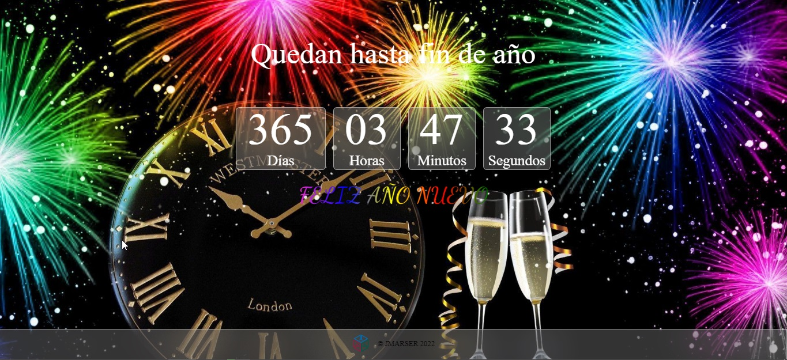
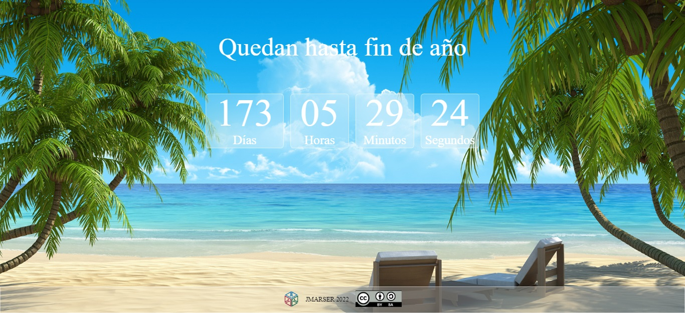
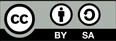

CUENTA ATRAS FIN DE AÑO
===

Aplicación web que muestra en una cuenta atrás los días, horas, minutos y segundos que quedan para llegar a fin de año.
No es necesario indicarle el año, ya que al iniciarse obtiene el año en curso.

### 1. Tecnologías ###
La aplicación esta desarrollada con tecnología front-end
- HTML
- CSS
- JavaScript

### 2. Funciones ###
La aplicación desarrolla de manera automática:
- Muestra los días, horas, minutos y segundos que quedan para llegar a fin de año.
- Al llegar al fin de año, calcula cual es el nuevo año y comienza de nuevo la cuenta atrás.
- En los cambios de estaciones, cambia la imagen de fondo.
- Al llegar a navidad muestra un mensaje de "feliz navidad".
- El día 1 de Enero muestra un mensaje de "Feliz año nuevo".

### 3. Algunas capturas ###

### 4. Licencia ###
Puedes compartir esta aplicación atribuyendo al autor y sin realizarle modificaciones

